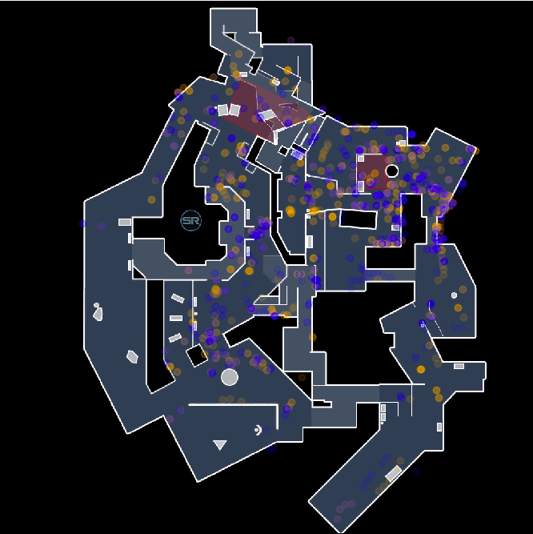

# CSGO-Demos  

A '20 summer project using [Saul's NodeJS demo parser](https://github.com/saul/demofile) to take a CSGO `.dem` file and transform it into a feather dataframe for later use. Currently [js/app.js](js/app.js) accepts a `.dem` file and writes to a file that matches the name with a `.out` extension, enumerating all damage and kill events in post-warmup play. Then, [python/clean.py](python/clean.py) accepts a `.out` file and reads it to a `.feather` file, which uses the *pandas to_feather* method to transform the pseudo-csv file (`.out`) to the feather format.  

**Example:**  

